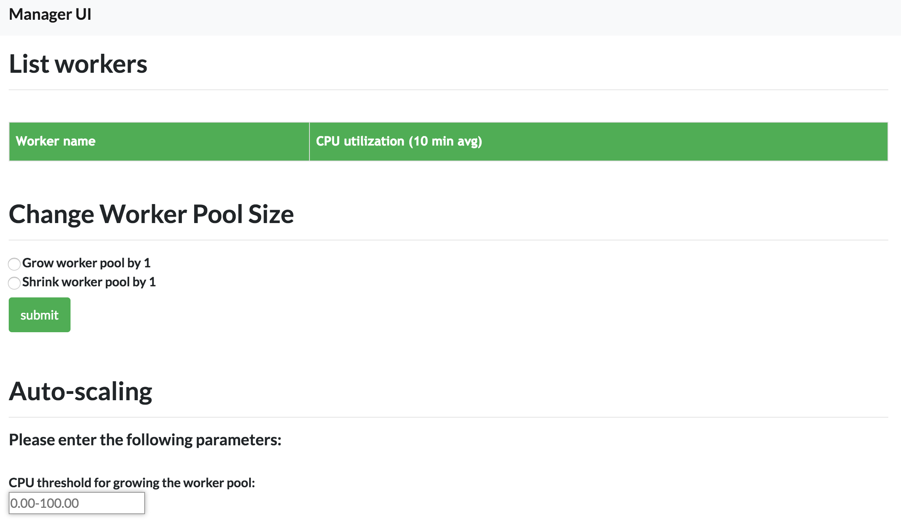
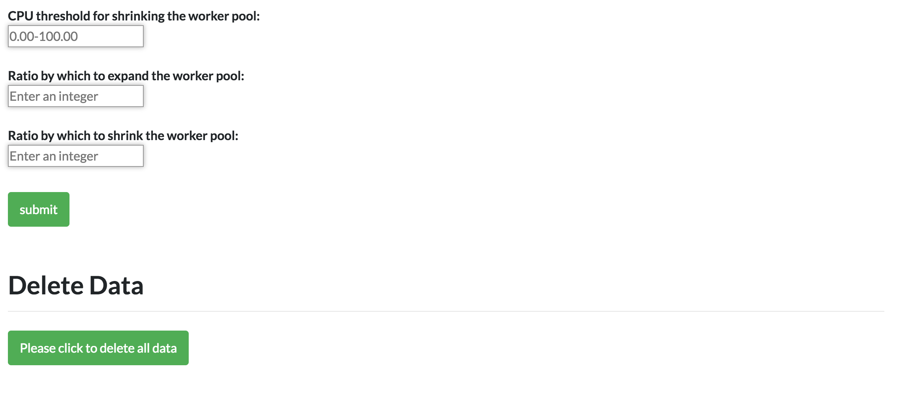
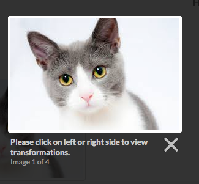

# Elastic Cloud Application

## Introduction
The purpose of this project is to develop an EC2 autoscaler that, in combination with AWS LBS, can self provision resources based on CPU usage. \
\
An application called Photo Gallary is developed to test the elasticity of the autoscaler. Details are explained below.

## Views
The autoscaler has a manager UI which let users monitor the active workers and their average CPU utilization. Users can also manage resources manually by add or remove EC2 instances based on threshold. 
### 1. ManagerUI page

### 2. UserUI Login

### 3. UserUI Dashboard

### 4. UserUI Img Transform

